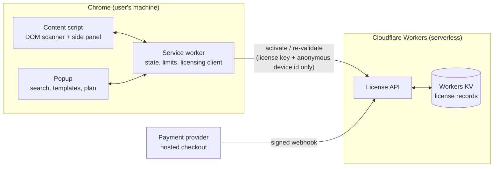

# HireReach — Job Post Email Organizer

> A Chrome extension that helps job seekers act on job posts faster: it finds recruiter email addresses shared publicly in LinkedIn posts the user is viewing and turns them into a organized, one-click outreach workflow.

**🔒 Closed source** — this repository documents the project's design and engineering. The source code is proprietary.

[**➜ Install from the Chrome Web Store**](YOUR-CHROME-WEB-STORE-LINK) · [Privacy Policy](https://tender-telescope-db8.notion.site/HireReach-Privacy-Policy-bf93aa8db405490c9d262837749b7afe) · [Terms of Service](https://tender-telescope-db8.notion.site/HireReach-Terms-of-Service-0ef589b27e644d4193e6feab46140a0b)

---

## The problem

Recruiters frequently post jobs on LinkedIn with a note like *"interested candidates, share your resume at hiring@company.com"*. Job seekers scroll past dozens of these daily, and acting on them means manually copying emails, tracking who they already wrote to, and composing the same application email again and again — usually in a messy notes file.

## The solution

HireReach lives inside the browser tab the user already has open. One click scans the visible LinkedIn posts, extracts every publicly shared recruiter email (including obfuscated ones), de-duplicates them against outreach history, and opens a side panel where the user can select contacts, apply a reusable email template, and launch a pre-filled compose window in their own Gmail/Outlook account.

Everything runs locally in the browser — no scraping servers, no automation, no data collection.

---

## Features

### Free
- One-click scanning of job posts in the current LinkedIn tab (feed, search results, single posts)
- Recognizes plain emails **and** human-obfuscated formats (`name [at] company [dot] com`, `name(at)company.com`, spaced-out addresses, etc.)
- Side panel with selection checkboxes, per-post context, and direct "View post" links
- Compose via the user's **own** email account (Gmail account chooser, Outlook, or system mail app) — the extension never sends email itself
- Job search launcher with LinkedIn-style filters (keywords, date posted, sort)
- Session and daily usage limits

### Pro (paid upgrade)
- Unlimited scanning
- CSV export of collected contacts
- "Already contacted" tracking with confirm-on-return flow
- Advanced email de-obfuscation decoder
- Reusable, editable email templates
- Higher daily compose caps

---

## Architecture

Two independently deployable parts: a Manifest V3 Chrome extension (all product logic) and a serverless licensing backend (all payment logic).

### Chrome extension (Manifest V3)
- **Vanilla JavaScript, zero runtime dependencies** — no frameworks, no bundler, no remote code (a Chrome Web Store policy requirement)
- **Content script** scans the rendered DOM of posts the user is already viewing; resilient selector strategy to tolerate LinkedIn markup changes; all text processing happens locally
- **Service worker** owns state: collected contacts, usage counters, templates, license status — all in `chrome.storage.local`
- **Side panel UI** injected as an isolated overlay with its own scoped styles

### Licensing backend (Cloudflare Workers + KV)
- Single worker, no cold-start-sensitive dependencies, deployed with Wrangler
- **Webhook endpoint**: verifies the payment provider's HMAC-SHA256 signature against the raw request body before trusting any payload; idempotent, so retried webhooks never issue duplicate keys
- **Key issuance**: generates human-friendly license keys from an unambiguous alphabet (no `0/O`, `1/I` confusion)
- **Claim endpoint**: self-service page where a buyer retrieves their key with the email used at checkout — needed because the payment provider's hosted pages redirect without any transaction parameters
- **Activation & re-validation endpoints**: bind a key to anonymous device identifiers with a per-key device cap; the extension re-validates periodically so revocations and expiry propagate without a store update

### Payments
- Hosted checkout via **Razorpay** (Stripe is invite-only in India — evaluated first, then pivoted)
- The developer never touches card data; the extension never talks to the payment provider directly
- Business model: single Pro tier, fixed-term license, **no auto-renewal** — deliberately simple to explain and refund-friendly

---

## Engineering challenges & decisions

**1. Scanning a hostile, ever-changing DOM.** LinkedIn's markup is obfuscated and changes without notice. The scanner anchors on structural patterns rather than brittle class names, and the product's legal terms explicitly frame detection as best-effort with no guarantee — an honest contract between the product and its users.

**2. Decoding human-obfuscated emails.** Recruiters write addresses like `jobs (at) acme (dot) com` to dodge scrapers. A normalization pipeline handles bracketed/spelled separators, spacing tricks, and mixed formats, then validates candidates before showing them.

**3. Building licensing from scratch.** Off-the-shelf SaaS licensing assumed Stripe, which isn't generally available in India. I designed a minimal license system instead: signed webhook → key issuance → device-capped activation → periodic re-validation. Total infrastructure cost: ~$0 (free tiers), no servers to maintain.

**4. Webhook trust and idempotency.** Payment webhooks are the only write path into the license store, so they verify a cryptographic signature computed over the raw body (not the parsed JSON) and are safe to replay.

**5. Working around payment-page limitations.** Discovered in production that the provider's hosted payment pages redirect *without* appending a transaction reference (unlike its payment-links product). Shipped a self-service claim page keyed on checkout email as the fallback — a fix informed by a real live-mode purchase.

**6. Chrome Web Store compliance.** Manifest V3, no remote code, single-purpose description, per-permission justifications, minimal data-usage disclosure (only a license key ever leaves the machine), and a public privacy policy. Privacy wasn't retrofitted; local-only processing was the design's starting point.

**7. Anti-abuse without surveillance.** License keys are capped to a fixed number of devices using random, anonymous device identifiers — no fingerprinting, no accounts, no personal data. Revoked or expired keys degrade gracefully to the free tier.

---

## Privacy by design

- Scanned emails, templates, history, and settings **never leave the user's device**
- No analytics, no tracking, no third-party scripts
- The only network call the extension makes is license validation: a license key + a random device id
- Email sending happens in the user's own mail client — HireReach never holds mail credentials

---

## Tech stack

| Layer | Technology |
|---|---|
| Extension | JavaScript (ES2022), Chrome Extension Manifest V3, `chrome.storage`, content scripts, service worker |
| UI | Hand-rolled HTML/CSS (popup + injected side panel), custom design system (navy/gold) |
| Backend | Cloudflare Workers, Workers KV, Wrangler CLI |
| Payments | Razorpay hosted payment pages + signed webhooks |
| Security | HMAC-SHA256 webhook verification, idempotent key issuance, device-capped activation |
| Distribution | Chrome Web Store (published listing, privacy disclosures, staged review process) |

---

## Outcome

- Shipped end-to-end as a solo project: product design → extension → payment infrastructure → legal docs (ToS / privacy policy) → Chrome Web Store submission
- Full payment pipeline verified with real transactions in both test and live modes
- Runs at effectively zero infrastructure cost

## Roadmap

- AI-assisted email personalization
- Follow-up reminders and outreach analytics
- Multiple resume profiles
- Support for additional job platforms

---

## Author

**Kashaf Ali** — [k4shafali@gmail.com](mailto:k4shafali@gmail.com)

*HireReach is an independent tool and is not affiliated with, endorsed by, or sponsored by LinkedIn Corporation. It only organizes information that posters chose to share publicly, and its terms require users to comply with anti-spam laws and platform policies.*
